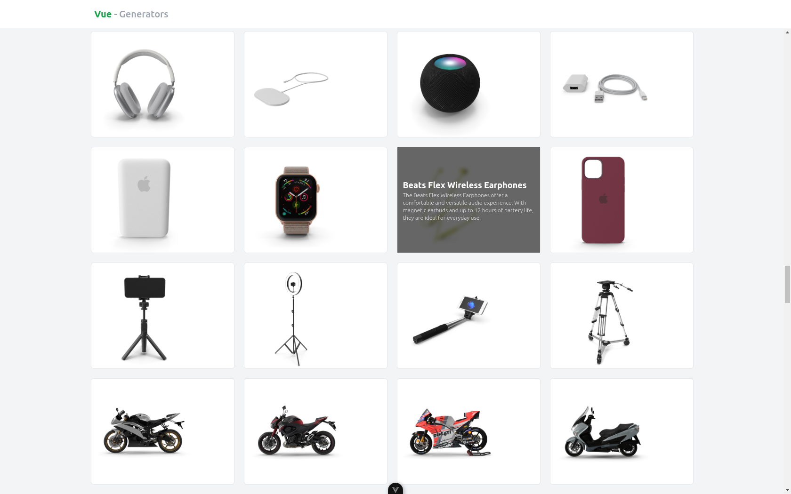

# generators-vue


This project was developed with the aim of demonstrating how to create and use generators in JavaScript applications, exploring their functionalities and benefits for asynchronous flow control and process optimization. In particular, the application uses generators to implement infinite scrolling, where dynamic data loading happens efficiently as the user scrolls the page, without the need to load all the data at once.

## Project Setup

```sh
pnpm install
```

### Compile and Hot-Reload for Development

```sh
pnpm dev
```

### Type-Check, Compile and Minify for Production

```sh
pnpm build
```

### Lint with [ESLint](https://eslint.org/)

```sh
pnpm lint
```
